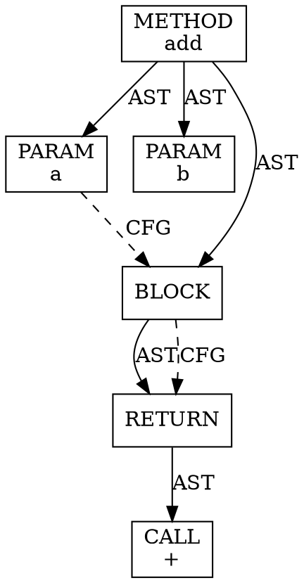

# Technical Architecture Overview

## System Architecture

### Component Interaction Diagram

```
┌────────────────────────────────────────────────────────────────┐
│                     Python Host System                          │
│                                                                  │
│  ┌──────────────────────────────────────────────────────────┐  │
│  │  analyze_code_with_joern()                               │  │
│  │                                                          │  │
│  │  ┌────────────────────────────────────────────────────┐ │  │
│  │  │  1. Input Validation & Workspace Setup             │ │  │
│  │  │     - Verify source path exists                    │ │  │
│  │  │     - Create temp workspace                        │ │  │
│  │  │     - Copy source to workspace/input/              │ │  │
│  │  └────────────────────────────────────────────────────┘ │  │
│  │                          │                               │  │
│  │                          ▼                               │  │
│  │  ┌────────────────────────────────────────────────────┐ │  │
│  │  │  2. Docker & Joern Verification                    │ │  │
│  │  │     - Check Docker daemon running                  │ │  │
│  │  │     - Pull joernio/joern:latest if needed          │ │  │
│  │  └────────────────────────────────────────────────────┘ │  │
│  │                          │                               │  │
│  │                          ▼                               │  │
│  │  ┌────────────────────────────────────────────────────┐ │  │
│  │  │  3. CPG Generation (Container 1)                   │ │  │
│  │  │     ┌──────────────────────────────────────┐       │ │  │
│  │  │     │ docker run --rm                      │       │ │  │
│  │  │     │   -v workspace:/workspace            │       │ │  │
│  │  │     │   joernio/joern:latest               │       │ │  │
│  │  │     │   joern --script analyze.sc          │       │ │  │
│  │  │     │                                      │       │ │  │
│  │  │     │ Script:                              │       │ │  │
│  │  │     │   importCode("/workspace/input")     │       │ │  │
│  │  │     │   save("/workspace/output/cpg.bin")  │       │ │  │
│  │  │     └──────────────────────────────────────┘       │ │  │
│  │  └────────────────────────────────────────────────────┘ │  │
│  │                          │                               │  │
│  │                          ▼                               │  │
│  │  ┌────────────────────────────────────────────────────┐ │  │
│  │  │  4. Graph Extraction (Container 2)                 │ │  │
│  │  │     ┌──────────────────────────────────────┐       │ │  │
│  │  │     │ docker run --rm                      │       │ │  │
│  │  │     │   -v workspace:/workspace            │       │ │  │
│  │  │     │   joernio/joern:latest               │       │ │  │
│  │  │     │   joern --script export.sc           │       │ │  │
│  │  │     │                                      │       │ │  │
│  │  │     │ Script:                              │       │ │  │
│  │  │     │   loadCpg("/workspace/output/cpg")   │       │ │  │
│  │  │     │   export AST → ast.dot               │       │ │  │
│  │  │     │   export CFG → cfg.dot               │       │ │  │
│  │  │     │   export nodes → nodes.json          │       │ │  │
│  │  │     │   export methods → methods.json      │       │ │  │
│  │  │     └──────────────────────────────────────┘       │ │  │
│  │  └────────────────────────────────────────────────────┘ │  │
│  │                          │                               │  │
│  │                          ▼                               │  │
│  │  ┌────────────────────────────────────────────────────┐ │  │
│  │  │  5. Post-Processing (Host)                         │ │  │
│  │  │     - Generate SVG from DOT (if Graphviz present)  │ │  │
│  │  │     - Copy outputs to final destination            │ │  │
│  │  │     - Build JoernAnalysisResult object             │ │  │
│  │  └────────────────────────────────────────────────────┘ │  │
│  │                          │                               │  │
│  │                          ▼                               │  │
│  │  ┌────────────────────────────────────────────────────┐ │  │
│  │  │  6. Return Results                                 │ │  │
│  │  │     - cpg_bin_path: Path                           │ │  │
│  │  │     - graphs: Dict[str, Any]                       │ │  │
│  │  │     - workspace_path: Path                         │ │  │
│  │  │     - source_info: Dict[str, str]                  │ │  │
│  │  └────────────────────────────────────────────────────┘ │  │
│  └──────────────────────────────────────────────────────────┘  │
└────────────────────────────────────────────────────────────────┘
```

---

## Data Flow

### Input → CPG → Graphs

```
┌──────────────┐
│ Source Code  │ (file or directory)
└──────┬───────┘
       │
       │ Copy to workspace/input/
       ▼
┌──────────────────┐
│ Workspace Input  │
└──────┬───────────┘
       │
       │ Joern Container 1: importCode()
       ▼
┌──────────────────────────────────────────────────┐
│           Code Property Graph (CPG)               │
│                                                   │
│  ┌──────────────┐  ┌──────────────┐              │
│  │     AST      │  │     CFG      │              │
│  │  (Abstract   │  │  (Control    │              │
│  │   Syntax     │  │   Flow       │              │
│  │   Tree)      │  │   Graph)     │              │
│  └──────────────┘  └──────────────┘              │
│                                                   │
│  ┌──────────────┐  ┌──────────────┐              │
│  │     DFG      │  │     PDG      │              │
│  │  (Data Flow  │  │  (Program    │              │
│  │   Graph)     │  │   Depend.)   │              │
│  └──────────────┘  └──────────────┘              │
│                                                   │
│  Unified graph combining all representations      │
└──────┬────────────────────────────────────────────┘
       │
       │ Serialize: save()
       ▼
┌──────────────────┐
│   cpg.bin        │ (Binary OverflowDB format)
└──────┬───────────┘
       │
       │ Joern Container 2: loadCpg() + export
       ▼
┌───────────────────────────────────────────────────┐
│           Exported Graph Formats                  │
│                                                   │
│  ┌──────────────┐  ┌──────────────┐              │
│  │   ast.dot    │  │   cfg.dot    │              │
│  │  (GraphViz   │  │  (GraphViz   │              │
│  │   format)    │  │   format)    │              │
│  └──────────────┘  └──────────────┘              │
│                                                   │
│  ┌──────────────┐  ┌──────────────┐              │
│  │ nodes.json   │  │ methods.json │              │
│  │ (Structured  │  │ (Metadata)   │              │
│  │  data)       │  │              │              │
│  └──────────────┘  └──────────────┘              │
└───────────────────────────────────────────────────┘
       │
       │ Optional: Graphviz dot -Tsvg
       ▼
┌──────────────────┐
│  Visualizations  │
│  - ast.svg       │
│  - cfg.svg       │
└──────────────────┘
```

---

## Container Lifecycle

### Ephemeral Containers Pattern

```
Time ──────────────────────────────────────────────▶

T0: Function called
    │
    ├─ Verify Docker
    ├─ Pull image (if needed)
    └─ Setup workspace
    
T1: CPG Generation Phase
    │
    ├─ docker run --rm ...           ◄─── Container 1 Start
    │   │
    │   ├─ Mount workspace
    │   ├─ Execute: joern --script analyze.sc
    │   │   │
    │   │   ├─ importCode()
    │   │   ├─ Parse source → CPG
    │   │   └─ save(cpg.bin)
    │   │
    │   └─ Container exits            ◄─── Container 1 End
    │       └─ Automatic cleanup (--rm)
    
T2: Graph Extraction Phase
    │
    ├─ docker run --rm ...           ◄─── Container 2 Start
    │   │
    │   ├─ Mount workspace (same volume)
    │   ├─ Execute: joern --script export.sc
    │   │   │
    │   │   ├─ loadCpg(cpg.bin)
    │   │   ├─ Export AST → DOT
    │   │   ├─ Export CFG → DOT
    │   │   ├─ Export nodes → JSON
    │   │   └─ Export methods → JSON
    │   │
    │   └─ Container exits            ◄─── Container 2 End
    │       └─ Automatic cleanup (--rm)
    
T3: Post-processing (Host)
    │
    ├─ Generate SVG (if Graphviz available)
    ├─ Copy to final output directory
    └─ Return JoernAnalysisResult
    
T4: Function returns
```

**Key Points:**
- **Stateless**: Each container is ephemeral (--rm flag)
- **Volume Mounting**: Workspace shared via Docker volumes
- **No Persistent Containers**: No long-running Joern processes
- **Clean Shutdown**: Automatic cleanup on exit

---

## Graph Representations

### CPG Internal Structure

```
┌─────────────────────────────────────────────────────────────┐
│                 Code Property Graph (CPG)                    │
│                                                              │
│  Node Types:                                                │
│  ┌──────────────────────────────────────────────────────┐   │
│  │ • METHOD         - Function/method declarations      │   │
│  │ • TYPE           - Class/struct/type definitions     │   │
│  │ • CALL           - Function/method invocations       │   │
│  │ • IDENTIFIER     - Variable references              │   │
│  │ • LITERAL        - Constant values                   │   │
│  │ • RETURN         - Return statements                 │   │
│  │ • BLOCK          - Code blocks                       │   │
│  │ • CONTROL        - If, while, for, etc.              │   │
│  │ • LOCAL          - Local variable declarations       │   │
│  │ • PARAMETER      - Function parameters               │   │
│  │ ... and many more                                    │   │
│  └──────────────────────────────────────────────────────┘   │
│                                                              │
│  Edge Types:                                                │
│  ┌──────────────────────────────────────────────────────┐   │
│  │ • AST             - Syntax tree edges                │   │
│  │ • CFG             - Control flow edges               │   │
│  │ • REF             - Reference edges                  │   │
│  │ • CALL            - Call graph edges                 │   │
│  │ • REACHING_DEF    - Data flow edges                  │   │
│  │ • DOMINATE        - Dominance edges                  │   │
│  │ • POST_DOMINATE   - Post-dominance edges             │   │
│  │ ... and many more                                    │   │
│  └──────────────────────────────────────────────────────┘   │
│                                                              │
│  Properties:                                                │
│  ┌──────────────────────────────────────────────────────┐   │
│  │ • name            - Identifier names                 │   │
│  │ • code            - Source code text                 │   │
│  │ • lineNumber      - Line numbers                     │   │
│  │ • columnNumber    - Column numbers                   │   │
│  │ • order           - AST child order                  │   │
│  │ • signature       - Method signatures                │   │
│  │ • fullName        - Fully qualified names            │   │
│  │ ... and many more                                    │   │
│  └──────────────────────────────────────────────────────┘   │
└─────────────────────────────────────────────────────────────┘
```

### Export Formats

#### 1. DOT Format (GraphViz)



**Use Cases:**
- Visual inspection
- Graph rendering (Graphviz, vis.js)
- Documentation generation

#### 2. JSON Format

```json
[
  {
    "id": "1",
    "label": "METHOD",
    "properties": {
      "name": "add",
      "signature": "int add(int, int)",
      "lineNumber": "5"
    }
  },
  {
    "id": "2",
    "label": "PARAMETER",
    "properties": {
      "name": "a",
      "typeFullName": "int",
      "order": "1"
    }
  }
]
```

**Use Cases:**
- Programmatic processing
- Database import (Neo4j, MongoDB)
- Custom analysis tools

#### 3. Binary Format (cpg.bin)

```
OverflowDB binary serialization
├─ Node storage (compressed)
├─ Edge indices
├─ Property maps
└─ Graph metadata
```

**Use Cases:**
- CPG persistence
- Fast loading (no re-parsing)
- Joern query interface

---

## Resource Management

### Memory Profile

```
┌────────────────────────────────────────────────────┐
│         Memory Usage by Phase                      │
├────────────────────────────────────────────────────┤
│                                                    │
│  Workspace Setup:        ~10 MB                   │
│  ├─ Source copy                                   │
│  └─ Script files                                  │
│                                                    │
│  Joern Container 1 (CPG Gen):                     │
│  ├─ Base: ~500 MB (JVM + Joern)                   │
│  ├─ Parsing: O(n) where n = LOC                   │
│  └─ Peak: 1-4 GB for large projects               │
│                                                    │
│  CPG Binary:                                       │
│  ├─ Size: ~10-100x source size                    │
│  └─ Example: 1 MB source → 10-100 MB CPG          │
│                                                    │
│  Joern Container 2 (Export):                      │
│  ├─ Base: ~500 MB                                 │
│  ├─ Loading CPG: RAM = CPG size + overhead        │
│  └─ Export overhead: minimal                      │
│                                                    │
│  Python Host:                                      │
│  ├─ Minimal (~50 MB)                              │
│  └─ Graphviz (if used): +100-500 MB               │
│                                                    │
└────────────────────────────────────────────────────┘

Recommendation: 4+ GB RAM for typical projects
                8+ GB RAM for large codebases
```

### Disk Usage

```
┌────────────────────────────────────────────────────┐
│         Disk Usage Pattern                         │
├────────────────────────────────────────────────────┤
│                                                    │
│  Workspace:                                        │
│  ├─ input/  : Copy of source code                 │
│  ├─ output/ : Generated artifacts                 │
│  └─ Total:  : 11-101x source size                 │
│                                                    │
│  CPG Binary:              10-100x source           │
│  DOT Files (AST + CFG):   2-10x source             │
│  JSON Files:              1-5x source              │
│  SVG Files:               5-20x DOT files          │
│                                                    │
│  Example (1 MB source):                            │
│  ├─ cpg.bin:     50 MB                            │
│  ├─ ast.dot:     3 MB                             │
│  ├─ cfg.dot:     2 MB                             │
│  ├─ nodes.json:  4 MB                             │
│  ├─ ast.svg:     15 MB                            │
│  └─ Total:       ~74 MB                           │
│                                                    │
└────────────────────────────────────────────────────┘
```

### Cleanup Strategy

```python
# Automatic cleanup (default)
result = analyze_code_with_joern("code.java")
# Workspace deleted after function returns

# Keep workspace for debugging
result = analyze_code_with_joern(
    "code.java",
    keep_workspace=True
)
# Workspace preserved at result.workspace_path
# Manual cleanup required:
import shutil
shutil.rmtree(result.workspace_path)

# Persistent output
result = analyze_code_with_joern(
    "code.java",
    output_dir="/permanent/storage"
)
# Artifacts copied to /permanent/storage
# Workspace still auto-cleaned
```

---

## Performance Characteristics

### Time Complexity

```
Operation                  | Complexity        | Typical Time
─────────────────────────────────────────────────────────────
Workspace setup           | O(n)              | 0.1-1 sec
Docker verification       | O(1)              | 0.1-0.5 sec
Image pull (first time)   | O(image_size)     | 30-120 sec
Container start           | O(1)              | 1-3 sec
CPG generation            | O(n)              | 0.2-2 sec per KLOC
CPG serialization         | O(n)              | 0.5-2 sec
Graph export (DOT)        | O(n + e)          | 0.5-3 sec
Graph export (JSON)       | O(n)              | 0.3-1 sec
SVG generation            | O(n + e)          | 1-10 sec
─────────────────────────────────────────────────────────────
TOTAL (cached image)      | O(n)              | 5-30 sec typical

Where:
  n = lines of code
  e = number of edges in graph
  KLOC = thousand lines of code
```

### Scalability

```
Code Size    | CPG Time  | Total Time | Memory   | Disk
──────────────────────────────────────────────────────────
1 KLOC       | 2 sec     | 5 sec      | 1 GB     | 50 MB
10 KLOC      | 10 sec    | 15 sec     | 1.5 GB   | 500 MB
100 KLOC     | 60 sec    | 90 sec     | 2-3 GB   | 5 GB
1 MLOC       | 600 sec   | 900 sec    | 4-8 GB   | 50 GB

Recommendations:
  < 100 KLOC:  Standard Docker (2 GB RAM)
  100K-500K:   4 GB RAM recommended
  > 500 KLOC:  8+ GB RAM, consider batch processing
```

---

## API Contract

### Function Signature

```python
def analyze_code_with_joern(
    source_path: Union[str, Path],
    output_dir: Optional[Union[str, Path]] = None,
    keep_workspace: bool = False
) -> JoernAnalysisResult
```

### Guarantees

**Always provides:**
- ✅ `cpg_bin_path`: Valid path to CPG binary
- ✅ `workspace_path`: Valid directory path
- ✅ `source_info`: Non-empty metadata dict
- ✅ `graphs`: Dict with at least some graph data

**May provide (best effort):**
- 🟡 `graphs['ast_dot']`: If AST export succeeds
- 🟡 `graphs['cfg_dot']`: If CFG export succeeds
- 🟡 `graphs['nodes_json_path']`: If node export succeeds
- 🟡 `graphs['ast_svg_path']`: If Graphviz available
- 🟡 `graphs['cfg_svg_path']`: If Graphviz available

**Never provides:**
- ❌ Vulnerability scores
- ❌ Code quality metrics
- ❌ Pattern match results
- ❌ Security recommendations

### Error Handling

```python
ValueError:
  ├─ Source path doesn't exist
  └─ Source path not file or directory

RuntimeError:
  ├─ Docker not installed
  ├─ Docker not running
  ├─ Image pull failure
  ├─ CPG generation failure
  └─ Timeout (>300 sec per phase)

No exceptions for:
  ├─ Partial graph extraction
  ├─ Missing Graphviz
  └─ Scala serialization quirks
  (Function continues, returns available data)
```

---

## Extension Points

### Where to Add Custom Logic

```python
# ❌ DO NOT modify joern_analyzer.py for:
#    - Vulnerability detection
#    - Code scoring
#    - Pattern matching

# ✅ DO create separate modules:

from joern_analyzer import analyze_code_with_joern

# 1. Custom analysis on CPG
def my_security_analysis(cpg_path):
    # Load and query CPG with custom Joern scripts
    pass

# 2. Custom graph processing
def extract_call_graph(graphs):
    # Process DOT or JSON to build call graph
    pass

# 3. Integration wrapper
def ci_pipeline_analysis(repo_path):
    result = analyze_code_with_joern(repo_path)
    security_score = my_security_analysis(result.cpg_bin_path)
    call_graph = extract_call_graph(result.graphs)
    return {
        'cpg': result,
        'security': security_score,
        'calls': call_graph
    }
```

---

## Summary

This architecture provides:

1. **Single Responsibility**: Only CPG generation and graph extraction
2. **Clean Separation**: Analysis logic separate from graph generation
3. **Reproducibility**: Deterministic outputs for given inputs
4. **Containerization**: Isolated, version-controlled Joern
5. **Flexibility**: Multiple export formats for different use cases
6. **Resource Efficiency**: Ephemeral containers, cleanup by default
7. **Extensibility**: Clean API for building on top

The function acts as a **graph generation service** - producing high-quality, structured representations of code that can be consumed by any downstream analysis tool or workflow.
